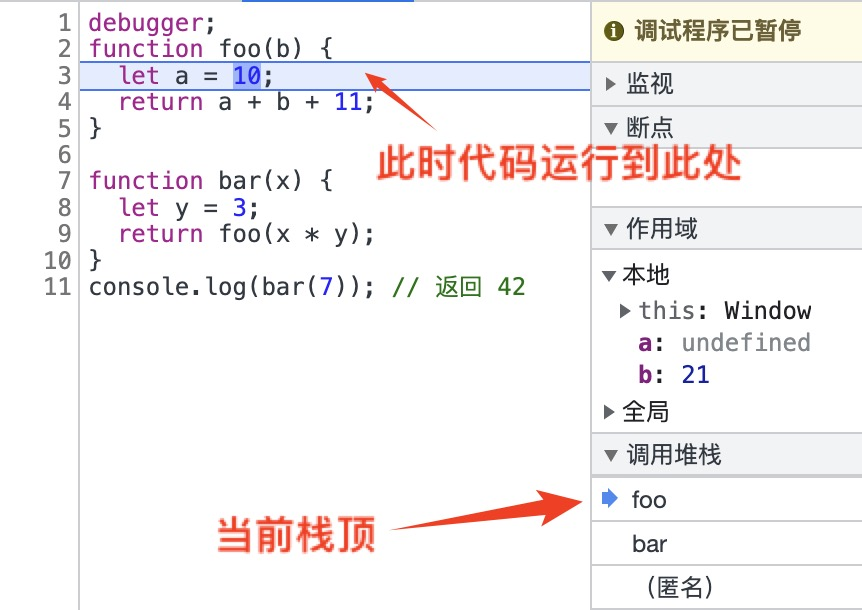
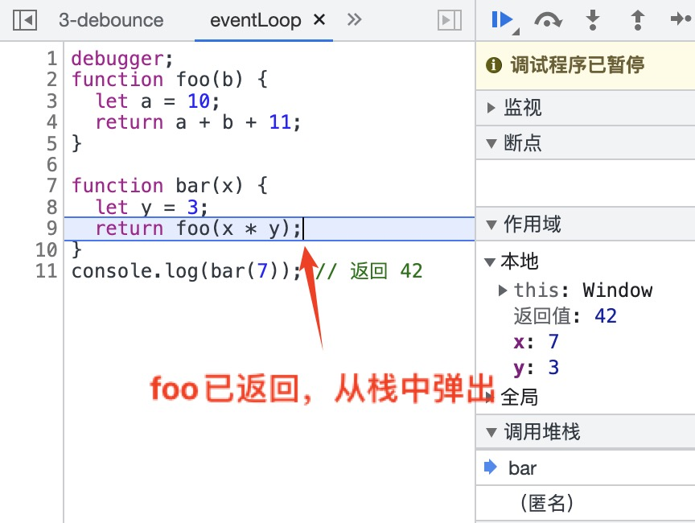

# 事件循环

JavaScript 是单线程语言，为了实现一些操作，浏览器提供了一些异步、非阻塞的`Web API`(`DOM`、`HTTP`、`setTimeout`)。

## [调用栈](../调用栈)

函数调用时会推入调用栈，当函数返回的时候弹出。


```
function foo(b) {
  let a = 10;
  return a + b + 11;
}

function bar(x) {
  let y = 3;
  return foo(x * y);
}
console.log(bar(7)); // 返回 42
```

- step1
  
- step2
  

## 事件队列

JavaScript 运行时有一个队列来存放待处理消息的消息队列。

## 流程

当代码执行的时候，碰到 Web API 如 setTimeout，就会将 setTimeout 的回调函数添加到 Web API 中执行，此时并不会添加到调用栈中，而是添加到事件队列里。**`当调用栈为空的时候，就会弹出事件队列中的任务并添加到调用栈中，当调用栈又为空的时候就循环上述操作`**，事件循环就是连接调用栈和事件队列。

## 异步任务

### 宏任务

- <script>
- setTimeout
- setInterval
- setImmediate
- I/O
- UI Event
- requestAnimationFrame

### 微任务

- Promise.then()/resolve()
- process.nextTick
- MutaionObserver

### 机制
**当执行栈为空的时候，主线程会查看宏任务队列是否有事件存在，如果存在则将最老的宏任务添加到执行栈，在这个宏任务的执行过程中如果遇到微任务，就会将其添加到微任务队列中，当这个宏任务执行完之后会依次执行微任务队列。并且在宏任务执行完毕之后会检查渲染，然后GUI线程接管渲染来实现重绘和回流。当渲染完毕之后JS线程继续接管，开始继续从事件队列取最老的宏任务执行。**

# 参考

[MDN|EventLoop](https://developer.mozilla.org/zh-CN/docs/Web/JavaScript/EventLoop)
