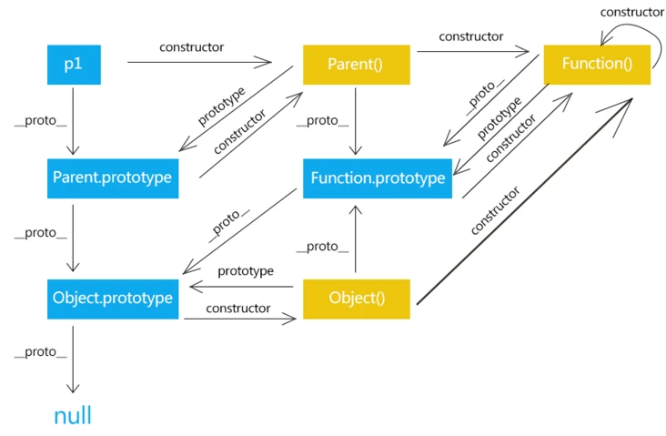

# 原型链
首先在JavaScript里面，每个构造函数都有一个`prototype`属性，指向构造函数的原型对象，而这个原型对象中的`constructor`则指向构造函数。

同时每个实例中都有一个`__proto__`属性(Object.create的不一定有)，这个属性会指向构造函数的原型对象。

那假如我们让原型对象等于另一个类型的实例，那这时候原型对象将包含一个指向另一个原型的指针，而这个原型又包含指向另外一个构造函数的指针，这种层层递进的构成了实例和原型的链条，就是原型链。

当访问一个对象的属性或者方法的时候，会先在对象内部查找，如果没有就沿着原型链向上查找，直到原型链的`顶端Object.prototype.__proto__`

> **总结来说的话：原型链就是对象之间的关联关系**
