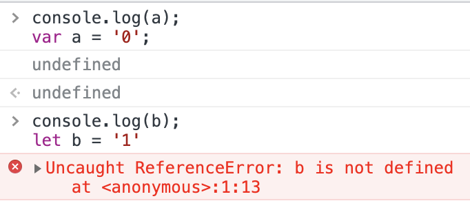

# 暂时性死区
通过 `let`或者`const` 声明的变量直到它们的定义被执行时才初始化。在变量初始化前访问该变量会导致 ReferenceError。该变量处在一个自块顶部到初始化处理的“暂存死区”中。

## 原因
`let`和`const`为正在运行的[执行上下文](../执行上下文)的[词法环境](../词法环境)声明的变量，实例化是在环境记录创建时，在`LexicalBinding`之前无法访问。

> [ECMA | Let and Const Declarations](https://tc39.es/ecma262/#sec-let-and-const-declarations)      
> [ECMA | Static Semantics: Early Errors](https://tc39.es/ecma262/#sec-let-and-const-declarations-static-semantics-early-errors)
