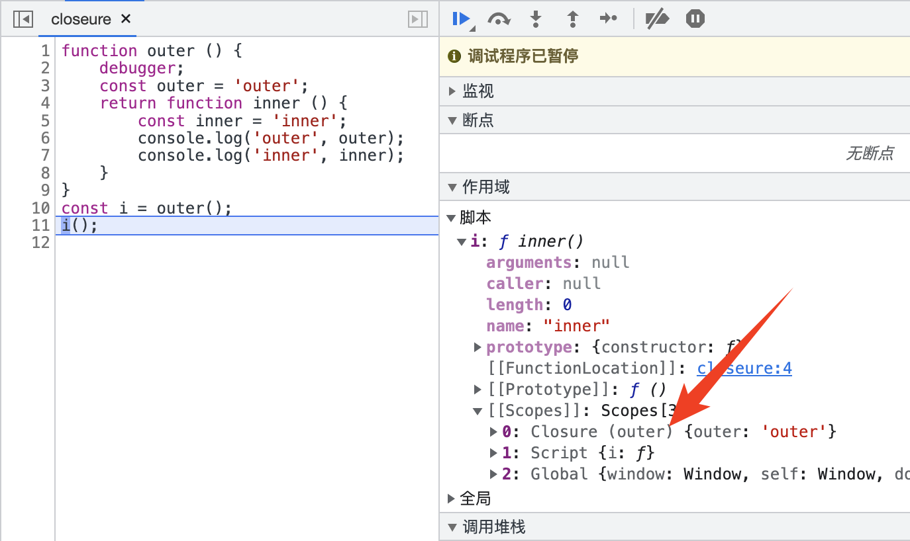

# 闭包
闭包是指一个函数可以访问其外部函数作用域，这意味着闭包可以记住并访问外部函数的变量和参数，甚至是外部函数结束之后。   

从闭包这个术语来说，是指函数变量可以被隐藏于作用域链内，所以看起来像是函数将变量包裹起来了。    

> 出现闭包是因为JavaScript采用词法作用域，函数的执行依赖于变量作用域，而这个作用域就是[执行上下文](../执行上下文)中的作用域链。

## 调试
```
function outer () {
    debugger;
    const outer = 'outer';
    return function inner () {
        const inner = 'inner';
        console.log('outer', outer);
        console.log('inner', inner);
    }
}
const i = outer();
i();
```

> 作用域[[Scopes]]内有outer指针指向outer函数内部


## 使用场景：
1. 防抖
2. 节流
3. 模拟私有方法
4. 柯里化
