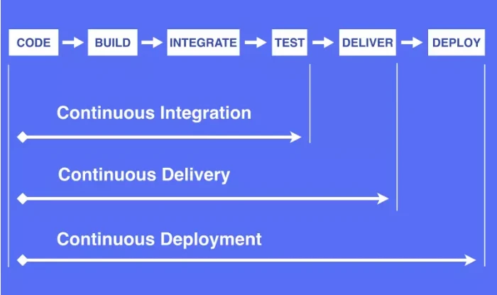

# 工作流
流程：**`编码 -> 构建 -> 集成 -> 测试 -> 交付 -> 部署`**

# CI
## 持续集成(Continuous Integration)
  - 自动化测试
  - 灵活的基础设施
    > 容器、虚拟机...
  - 版本控制工具
    > Git、SVN...
  - 自动化构建和软件发布流程饿工具
    > Jenkins
  - 反馈机制
    > 构建/测试失败通知到相关负责人
# CD
## 持续交付(Continuous Delivery)
## 持续部署(Continuous Deployment)
# 参考
[简书｜谈谈持续集成，持续交付，持续部署之间的区别](https://www.jianshu.com/p/2c6ebe34744a)