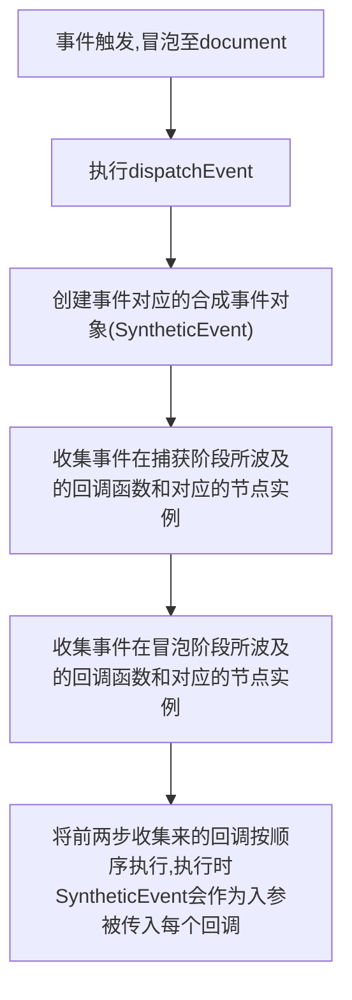

# React 事件合成

> 同时
> React 自己实现了一套高效的事件注册，存储，分发和重用逻辑。在 DOM 事件体系基础上改进，减少了内存消耗，简化事件逻辑，并最大化解决 IE 等浏览器的不兼容问题。与 DOM 事件体系相比，有以下特点：

## 设计思想

## 流程

1. React 组件上声明的事件最终绑定到`document`这个 DOM 节点上(react17 注册到`root`)，而不是 React 组件对应的 DOM 节，简化了 DOM 原生事件，减少了内存开销。
2. React 以队列的方式，从接触事件的组件向父组件回溯，调用在 JSX 中声明的 callback。也就是 React 自身实现了一套事件冒泡机制。我们没办法使用`event.stopPropagation()`来停止事件传播，而应该使用`event.preventDefault()`。
3. React 有自己一套的合成事件 SyntheticEvent，不同类型的事件会构造不同的 SyntheticEvent。
4. React 使用对象池来管理合成事件对象的创建和销毁，这样减少了垃圾的生成和新对象内存分配，从而提高性能
   优点：

- 分层设计：解决跨平台问题
- 性能优化：使用事件代理统一接收原生事件的触发，从而使真实 DOM 上不需要绑定事件
- 挟持事件：对事件进行归类，可以在事件产生的任务上包含不同的优先级，最终决定对应的更新应该在什么时机进行
- 提供合成事件对象：抹平浏览器的兼容性差异
  主要整个事件系统分为三部分：

1. 事件注册
2. 事件存储
3. 事件执行

# v17 版本更新

- 监听器挂载节点从 Document 节点改为 RootNode(根 DOM 节点)
  其主要作用是收束合成事件系统的影响范围，假设 Web 应用中使用了一个 React 应用同时还有其他应用使用了 Document 的事件监听，这大概率会引起某一方的错误。
- 当挂载 root 时，添加所有已知的事件监听器，而不是在 completeWork 阶段按需添加监听器
  主要是修复`createProtal`导致事件冒泡的问题
- 移除事件池
  原来为了提高性能存在的设计，导致事件中异步更新的一些心智负担，所以在没有太大性能影响下移除了。

# 参考

[React v17.0.0 合成事件系统源码解析](https://zhuanlan.zhihu.com/p/384192871)
