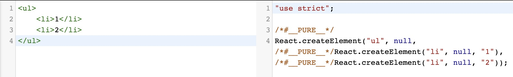

# 虚拟 DOM

虚拟 DOM 就是 DOM 的映射，一些 DOM 相关操作先在虚拟 DOM 上执行操作，然后再渲染成 DOM。

## 动机

1. 抽象化渲染过程
2. 跨端渲染

## 工作原理
- React    
  在`React`中，编写的`JSX`代码会被转译成对应`React.createElement`代码。
  
  > [babel | try](https://babeljs.io/repl)
