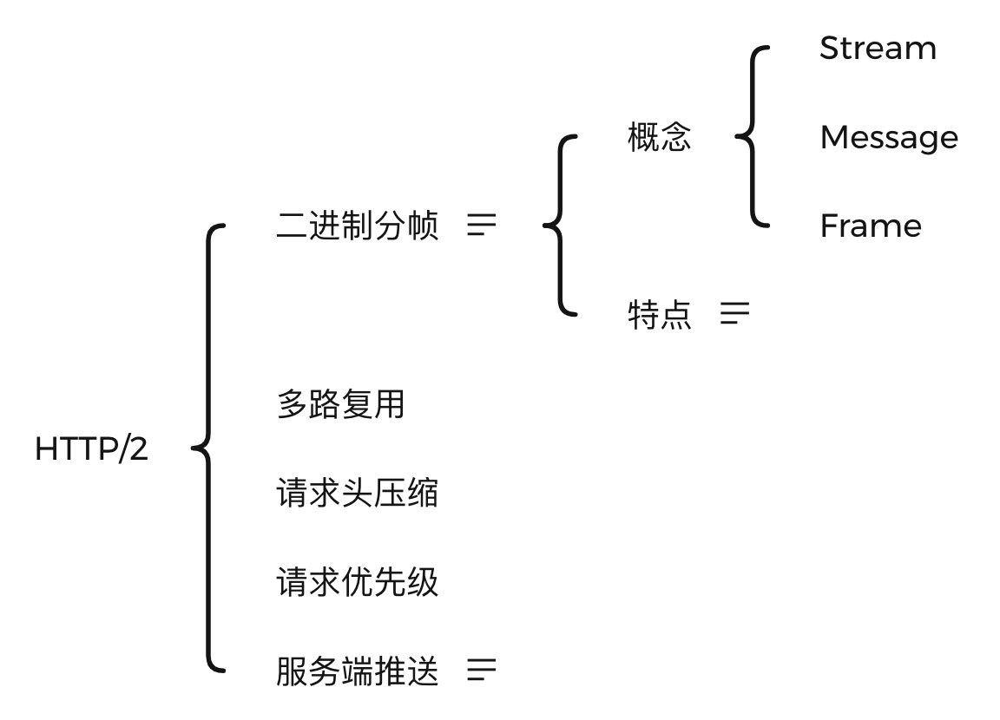

# HTTP

## 历史

### HTTP0.9

只有 GET 请求，并且只能传输文本 html 格式，返回的内容是 ASCII 字符串流

### HTTP1.0

- 二进制文件传输(视频音频图片)
- 请求头/响应头信息(原来只需要传输数据)
- 状态码(status code)
- 多字符集支持
- 缓存(cache)
- 新增 POST 和 HEAD 等请求方法
- 非标准的长链接  
  请求头添加`Connection: keep-alive`，默认不开启
- 内容编码(content encoding)
- 多部分发送(multi-part type)

### HTTP1.1

- 管道机制(pipeling)
- 默认开启`keep-alive`
- 头信息`Content-Length`
- 更多的请求方式，如 PUT、PATCH、OPTIONS、DELETE 等
- 头信息 Host
- 支持断点续传
- 24 个错误状态响应码

### HTTP/2

### 2.0(2015)

基于 SPDY(发音同`speedy`)协议，主要解决 HTTP1.1 效率不高的问题。

#### 新增

- **`二进制分帧`**  
  将一个 TCP 连接分为若干个流(`Stream`)，每个流中可以传输若干消息(`Message`)，每个消息由若干最小的二进制帧(Frame)组成。每个用户的操作行为会分配一个流编号(`Stream ID`)，表明用户与服务端之间创建了一个 TCP 通道；  
  协议将每个请求分割为二进制的控制帧和数据帧。

  | HTTP1.x   | HTTP2.0   |
  | --------- | --------- |
  | StartLine | Length    |
  | Header    | Type      |
  | Body      | Flags     |
  |           | Stream ID |
  |           | Payload   |

- `多路复用(Multiplexing)`  
  比起 HTTP1.1，HTTP2 的多路复用不需要先入先出
- `请求头压缩`  
  HPACK 算法基于霍夫曼编码
- `请求优先级`  
  设置 Stream 改变其优先级(Priority)和依赖(Dependency)，优先级高的会有限返回，stream 还能依赖其他 sub streams。两个属性都是可以动态调整的。
- `服务端推送(Server Push)`  
  即服务端向客户端发送比客户端请求更多的数据，允许服务器直接提供浏览器渲染页面所需资源，而不需要浏览器收到、解析页面之后再发起一轮请求

### HTTP/3

### 3.0(2018)

基于 UDP 的 QUIC(Quick UDP Internet Connection)协议，主要解决 HTTP2.0 中存在的 TCP 拥塞控制影响导致少量的丢包就会导致整个 TCP 连接的所有流被阻塞。

- 相比 HTTP2 优势
  - `减少TCP三次握手及TLS握手时间`
  - `改进的拥塞控制`  
    QUIC 协议当前默认使用 TCP 协议的 Cubic 拥塞控制算法，同时也支持 CubicBytes、Reno、RenoBytes、BBR、PCC
  - `避免队头阻塞的多路复用`
  - `连接迁移`  
    网络环境变更，如 WIFI 切蜂窝
  - `前向冗余纠错`  
    重要的包比如握手信息丢失的时候能够根据冗余信息还原握手信息
  - `可拔插`
    1. 应用程序层就能实现不同的拥塞控制算法，不需要操作系统和内核支持。因为传统的 TCP 拥塞控制必须端到端的网络协议栈支持才行，在网络爆炸式增长的今天无法满足。
    2. 即使是单个应用程序的不同连接也能支持配置不同的拥塞控制，可以为各个用户提供不同但是又更加精准的拥塞控制。
    3. 应用程序不需要停机进行升级就能实现拥塞控制的变更，只需要服务端修改配置后 reload 就能进行切换 -` 单调递增的Packet Number`  
       QUIC 使用 Packet Number 代替 TCP 的 sequence number，并且每个 Packet Number 严格递增，重传的 Packet N 的 number 已经不是 N，而是比 N 大的值。  
       TCP 在上述情况下会重传一个 sequence number 一致的数据，当收到两个 sequence number 一致的数据时无法判断时原来的数据还是重传的数据。

## 状态码

- 1xx -> 信息性状态码 -> 接受的请求正在处理
- 2xx -> 成功状态码 -> 请求处理完毕
- 3xx -> 重定向状态码 -> 需要进行附加操作以完成请求
- 4xx -> 客户端错误状态码状态码 -> 服务器无法处理请求
- 5xx -> 服务器错误状态码 -> 服务器处理请求出错

---

| 状态码 | 描述                                       |
| ------ | ------------------------------------------ |
| 200    | 成功                                       |
| 201    | 成功创建新资源的状态                       |
| 204    | 服务器已满足请求，但不需要恢复             |
| 304    | 命中协商缓存                               |
| 400    | 服务器由于客户端错误而无法理解或者请求处理 |
| 401    | 需要身份验证但失败或未提供身份             |
| 403    | 与 401 类似，一般是缺乏权限                |
| 404    | 服务器无法找到该资源                       |
| 409    | 请求与资源当前状态冲突                     |
| 410    | 请求资源不再可用                           |
| 500    | 错误                                       |

## 简单请求/复杂请求

- `简单请求`  
  普通 HTML Form 可以发出的请求(method 方法、enctype 编码)，且 Form 表单发出的请求不会触发同源策略，因为 submit 之后是没有返回的。  
  简单请求不发`preflight`不是不能兼容，而是兼容为前提下发`preflight`对绝大多数服务器应用来说没有意义，反而把问题搞复杂。
- `非简单请求`  
  除了简单请求就是非简单请求了，**需要注意跨域情况下会走`CORS-preflight机制`**
