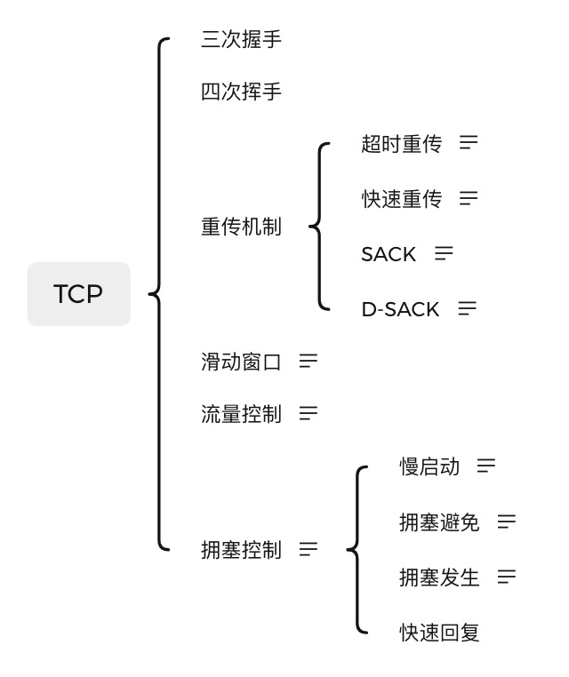

# TCP

## 三次握手

## 四次挥手

## 重传机制

### 超时重传

> 重传机制的其中一个方式，就是在发送数据时，设定一个定时器，当超过指定的时间后，没有收到对方的 ACK 确认应答报文，就会重发该数据，也就是我们常说的超时重传。

TCP 会在以下两种情况发生超时重传：

- 数据包丢失
- 确认应答丢失

### 快速重传

> 快速重传的工作方式是当收到三个相同的 ACK 报文时，会在定时器过期之前，重传丢失的报文段。

### SACK

SACK（ Selective Acknowledgment 选择性确认）。

> 这种方式需要在 TCP 头部「选项(option)」字段里加一个 SACK 的东西，它可以将缓存的地图发送给发送方，这样发送方就可以知道哪些数据收到了，哪些数据没收到，知道了这些信息，就可以只重传丢失的数据。

### D-SACK

Duplicate SACK 又称 D-SACK，其主要使用了 SACK 来告诉「发送方」有哪些数据被重复接收了。  
D-SACK 有这么几个好处：

- 可以让「发送方」知道，是发出去的包丢了，还是接收方回应的 ACK 包丢了;
- 可以知道是不是「发送方」的数据包被网络延迟了;
- 可以知道网络中是不是把「发送方」的数据包给复制了;

## 滑动窗口

**数据包的往返时间越长，通信的效率就越低。**

为解决这个问题，TCP 引入了窗口这个概念。即使在往返时间较长的情况下，它也不会降低网络通信的效率。
那么有了窗口，就可以指定窗口大小，窗口大小就是指无需等待确认应答，而可以继续发送数据的最大值。

所以，通常窗口的大小是由接收方的窗口大小来决定的。

接收方可用窗口耗尽，在没收到 ACK 确认之前是无法继续发送数据了。

## 流量控制

TCP 提供一种机制可以让「发送方」根据「接收方」的实际接收能力控制发送的数据量，这就是所谓的流量控制。

## 拥塞控制

### 慢启动

慢启动的算法记住一个规则就行：当发送方每收到一个 ACK，拥塞窗口 cwnd 的大小就会加 1。

那慢启动涨到什么时候是个头呢？

有一个叫慢启动门限 ssthresh（slow start threshold）状态变量。
当 cwnd < ssthresh 时，使用慢启动算法。
当 cwnd >= ssthresh 时，就会使用「拥塞避免算法」。

### 拥塞避免

当拥塞窗口 cwnd 「超过」慢启动门限 ssthresh 就会进入拥塞避免算法。

一般来说 ssthresh 的大小是 65535 字节。

那么进入拥塞避免算法后，它的规则是：每当收到一个 ACK 时，cwnd 增加 1/cwnd。

### 拥塞发生

拥塞窗口增长着后，网络就会慢慢进入了拥塞的状况了，于是就会出现丢包现象，这时就需要对丢失的数据包进行重传。

当触发了重传机制，也就进入了「拥塞发生算法」。

### 快速回复
TODO

# 参考

[你还在为 TCP 重传、滑动窗口、流量控制、拥塞控制发愁吗？看完图解就不愁了](https://read01.com/d0yL3kB.html#.YmVa8vNBy3I)
