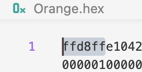

# JPG

## 结构

- 格式描述
  JPG 文件前 2 个字节`ffd8`(SOI)，后 2 个字节`ffd9`(EOI)。
  

  > ff 开头表明是 Marker

- | Short Name |             Name             | Description        | HEX         |
  | :--------: | :--------------------------: | ------------------ | ----------- |
  |    SOI     |        Start Of Image        | 文件头             | ffd8        |
  |    APPn    |     Application-specific     | 图像识别信息(EXIF) | ffe0 ~ ffef |
  |    DQT     | Define Quantization Table(s) | 定义量化表         | ffdb        |
  |    SOF0    | Start Of Frame(baseline DCT) | 图像基本信息       | ffc0        |
  |    DHT     |   Define Huffman Table(s)    | 定义 Huffman 表    | ffc4        |
  |    SOS     |        Start Of Scan         | 扫描行开始         | ffda        |
  |    EOI     |         End Of Image         | 文件尾             | ffd9        |
  > 上述表有省略，详情请到[JPG ｜ 维基百科](https://en.wikipedia.org/wiki/JPEG#Syntax_and_structure)进行查阅

## 解读

[Demo hex](./hex)

- SOI  
  `ffd8`
- APP0  
  从`ffe0`开始到`ffe1`。  
  `ffe0`紧接着两个字节是 APP0 的长度`0010`即 16 位，即`00 10 4a 46 49 46 00 01 01 00 00 48 00 48 00 00`，这就是 APP0 的内容。

# 参考

- [JPEG/Exif/TIFF 格式解读(1):JEPG 图片压缩与存储原理分析 ｜ 知乎](https://zhuanlan.zhihu.com/p/163502463)
- [JPG ｜ 维基百科](https://en.wikipedia.org/wiki/JPEG#Syntax_and_structure)
- [JPEG/Exif/TIFF 格式解读(2):图片元数据保存及 EXIF 详解](https://www.zhoulujun.net/html/theory/multimedia/CG-CV-IP/8397.html)
